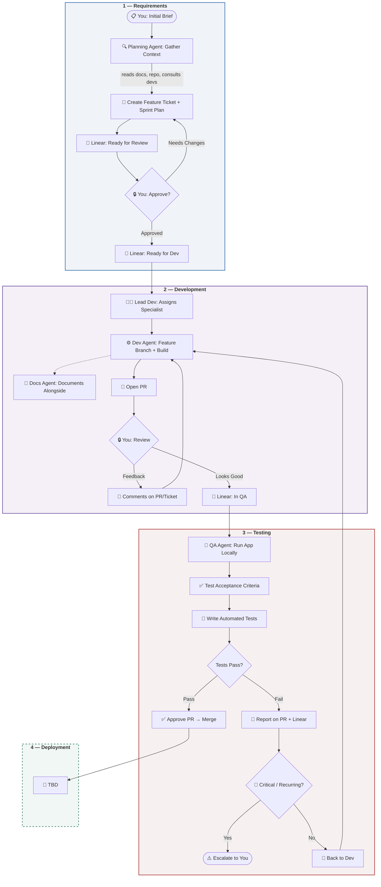

# Agentic SDLC

A process framework for AI-augmented software development. Specialized agents execute work, humans orchestrate and approve.

## How It Works

You provide a brief. Agents plan, build, test, and document — all tracked through Linear. You review at two gates before anything ships.



## Agents

| Agent | Role | Supervised By |
|-------|------|---------------|
| **Planning Agent** | Requirements gathering, context discovery, Linear tickets, sprint planning | You |
| **Lead Dev Agent** | Assigns work to specialists, oversees development quality | You |
| **Dev Agent(s)** | Specialized per stack — builds features on feature branches | Lead Dev |
| **Docs Agent** | Documents alongside development | Lead Dev |
| **QA Agent** | Functional testing, automated test writing, reports on PR + Linear | You |

Each agent has a versioned spec in [`agents/`](agents/) with prerequisites, outputs, and orchestration flowcharts.

## Human Gates

| Gate | When | What You Do |
|------|------|-------------|
| **Gate 1** | After planning, before dev | Review feature ticket + sprint plan on Linear |
| **Gate 2** | During/after dev, before merge | Review implementation, provide feedback via PR/ticket comments |

Your feedback is treated the same as QA feedback — dev agent sees both and adapts on the same branch.

## Project Setup (Per Client)

Every client project gets:
- Isolated GitHub repo + environments (dev/staging/prod)
- Linear workspace
- CI/CD pipeline
- Branch protection rules
- Secret management (no cross-client visibility)
- Cost monitoring (tokens per agent per project)

## Key Principles

- **Linear is the source of truth** — tickets, statuses, handoffs, metrics, client visibility
- **Specialized agents > generalists** — right tool for the job, supervised by lead dev
- **Project isolation** — no cross-client data leaks
- **You are the client interface** — no direct client-to-agent communication
- **Per-feature pricing** — scoped, measurable, transparent
- **Same branch, persistent context** — dev agents see their prior work + all feedback

## Directory Structure

```
agentic-sdlc/
├── README.md
├── agents/                     # Agent specs (versioned)
│   ├── planning-agent.md
│   ├── lead-dev-agent.md
│   ├── dev-agent.md
│   ├── docs-agent.md
│   └── qa-agent.md
├── templates/                  # Reusable templates
│   ├── initial-brief.md        # What you fill out to kick off a feature
│   ├── feature-ticket.md       # Linear ticket structure
│   └── project-setup.md        # New client project checklist
├── patterns/                   # Company-wide patterns library
│   └── README.md
└── process/                    # Process documentation
    ├── lifecycle.md            # Detailed stage-by-stage walkthrough
    ├── linear-workflow.md      # Linear board columns + status transitions
    └── agent-versioning.md     # How agents are versioned + tracked
```

## Pricing

Per-feature model. Each feature ticket is a deliverable with defined acceptance criteria. Cost = agent token usage + infrastructure + margin.

---

*Framework v2.0 — Built for agentic development teams*
