# Agentic SDLC — Software Development Lifecycle Framework

A comprehensive, ISO 9001:2015-aligned process framework for agentic software development. Designed for AI-augmented teams where human leads orchestrate AI agents through a structured 7-stage lifecycle.

## 🗺️ Lifecycle Overview

```mermaid
flowchart TD
    subgraph S0["<b>0 — Pre-Sales</b>"]
        A1[📋 Receive RFP] --> A2[🔍 Feasibility Assessment]
        A2 --> A3{Go / No-Go?}
        A3 -->|No-Go| A_END([Project Declined])
        A3 -->|Go| A4[📝 Strategy & Proposal]
        A4 --> A5[✍️ Contract Signing]
        A5 --> A6[🤝 Project Handoff]
    end

    subgraph S1["<b>1 — Planning & Requirements</b>"]
        B1[🚀 Kickoff Meeting] --> B2[📊 Requirements Gathering]
        B2 --> B3[📖 User Stories & SRS]
        B3 --> B4[⚙️ Technical Feasibility]
        B4 --> B5[⚠️ Risk & Resource Planning]
        B5 --> B6{Requirements Approved?}
        B6 -->|Rework| B2
        B6 -->|Approved| B7[✅ Planning Signoff]
    end

    subgraph S3["<b>3 — Design</b>"]
        C1[🏗️ Architecture Design] --> C2[🗄️ Database & API Design]
        C2 --> C3[🎨 UI/UX Design]
        C3 --> C4[📐 Low-Level Design]
        C4 --> C5{Design Review}
        C5 -->|Issues Found| C1
        C5 -->|Approved| C6[✅ Design Signoff]
    end

    subgraph S4["<b>4 — Development</b>"]
        D1[🔧 Env & Repo Setup] --> D2[💻 Code Development]
        D2 --> D3[📝 Code Documentation]
        D3 --> D4[🧪 Unit Testing]
        D4 --> D5{Code Review}
        D5 -->|Changes Needed| D2
        D5 -->|Approved| D6[✅ Dev Complete]
    end

    subgraph S5["<b>5 — Testing & QA</b>"]
        E1[🔬 System & Manual Testing] --> E2[🔗 Integration Testing]
        E2 --> E3[⚡ Performance Testing]
        E3 --> E4{Bugs Found?}
        E4 -->|Yes| E5[🐛 Bug Resolution] --> E1
        E4 -->|No| E6[👤 User Acceptance Testing]
        E6 --> E7{UAT Passed?}
        E7 -->|Failed| E5
        E7 -->|Passed| E8[✅ Testing Signoff]
    end

    subgraph S6["<b>6 — Deployment & Release</b>"]
        F1[📦 Deployment Preparation] --> F2[🚀 Deploy to Production]
        F2 --> F3[✔️ Post-Deploy Verification]
        F3 --> F4{Deployment OK?}
        F4 -->|Failed| F5[⏪ Rollback] --> F1
        F4 -->|Success| F6[📚 User Training & Handoff]
        F6 --> F7([🎉 Project Complete])
    end

    A6 --> B1
    B7 --> C1
    C6 --> D1
    D6 --> E1
    E8 --> F1

    style S0 fill:#f0f7f0,stroke:#6B8E6B,stroke-width:2px
    style S1 fill:#f0f4f8,stroke:#4A7AB5,stroke-width:2px
    style S3 fill:#fdf5f0,stroke:#C4834C,stroke-width:2px
    style S4 fill:#f5f0f7,stroke:#7B5EA7,stroke-width:2px
    style S5 fill:#f7f0f0,stroke:#B54A4A,stroke-width:2px
    style S6 fill:#f0f7f5,stroke:#4A8B6E,stroke-width:2px
```



## 📐 Document Hierarchy (ISO 9001:2015)

```
Tier 1 — Quality Manual        (Organization-wide policies)
  └─ Tier 2 — SOPs             (Stage-level procedures — HOW a stage works)
       └─ Tier 3 — Work Instructions  (Step-by-step task guidance — HOW to do each task)
            └─ Tier 4 — Forms/Checklists/Templates  (Operational records & tools)
```

## 📁 Repository Structure

```
agentic-sdlc/
├── README.md                       ◀ You are here
├── 0-pre-sales/                    # Proposal, feasibility, handoff
│   ├── sop/sop.md                  # SOP-PRE-001
│   ├── work-instructions/          # WI-MGT-001 → 003
│   └── tier4-forms/                # 5 forms/templates
│
├── 1-planning-requirements/        # Combined planning + requirements
│   ├── sop/sop.md                  # SOP-PMR-001 v1.1.0
│   ├── work-instructions/          # WI-PMR-001 → 006
│   ├── tier4/                      # 20 forms/checklists
│   └── templates/                  # Charter, Contract templates
│
├── 3-design/                       # Architecture → UI/UX → LLD → Review
│   ├── sop/sop.md                  # SOP-DES-001
│   ├── work-instructions/          # WI-DES-001 → 006
│   ├── tier4-checklists/           # 8 checklists
│   ├── tier4-forms/                # 11 forms
│   └── tier4-templates/            # Architecture, DB, LLD templates
│
├── 4-development/                  # Env setup → Code → Test → Review
│   ├── sop/sop.md                  # SOP-DEV-001
│   └── work-instructions/          # WI-DEV-001 → 006
│
├── 5-testing/                      # System → Integration → UAT → Signoff
│   ├── sop/sop.md                  # SOP-QA-001
│   └── work-instructions/          # WI-QA-001 → 006
│
└── 6-deployment/                   # Prep → Deploy → Verify → Rollback → Handoff
    ├── sop/sop.md                  # SOP-OPS-001
    └── work-instructions/          # WI-OPS-001 → 005
```

## 📊 Completion Status

| Stage | SOP | Work Instructions | Tier 4 |
|-------|:---:|:-----------------:|:------:|
| **0 — Pre-Sales** | ✅ | ✅ 3 WIs | ✅ 5 docs |
| **1 — Planning & Requirements** | ✅ v1.1.0 | ✅ 6 WIs | ✅ 20 docs |
| **3 — Design** | ✅ | ✅ 6 WIs | ✅ 18 docs |
| **4 — Development** | ✅ | ✅ 6 WIs | ⏳ Pending |
| **5 — Testing** | ✅ | ✅ 6 WIs | ⏳ Pending |
| **6 — Deployment** | ✅ | ✅ 5 WIs | ⏳ Pending |

**Total:** 6 SOPs · 32 Work Instructions · 43 Tier 4 documents (of ~80 planned)

## 🔑 SOP Reference Map

| ID | Title | Stage | Scope |
|----|-------|-------|-------|
| SOP-PRE-001 | Proposal & Contract Management | 0 | RFP review → feasibility → proposal → handoff |
| SOP-PMR-001 | Planning & Requirements | 1 | Kickoff → requirements → risk → signoff |
| SOP-DES-001 | Design Phase | 3 | Architecture → DB/API → UI/UX → LLD → review |
| SOP-DEV-001 | Development Process | 4 | Env setup → code → docs → unit test → review |
| SOP-QA-001 | Testing & QA | 5 | System test → integration → UAT → signoff |
| SOP-OPS-001 | Deployment & Release | 6 | Prep → deploy → verify → rollback → training |

## 🤖 Agentic Context

This framework is designed for teams where **AI agents execute tasks** under human supervision:

- **Work Instructions (Tier 3)** are written to be actionable by both humans and AI agents
- **Checklists (Tier 4)** serve as verification gates — agents can self-check, humans approve
- **Forms (Tier 4)** capture structured data that agents produce and humans validate
- **SOPs (Tier 2)** define the orchestration flow a human PM follows to coordinate agents

### Roles in the Agentic Model

| Role | Human/AI | Responsibility |
|------|----------|----------------|
| PM / Lead | Human | Orchestration, approvals, stakeholder comms |
| Dev Agent | AI | Code implementation per WI-DEV-* |
| Design Agent | AI | Architecture & design docs per WI-DES-* |
| QA Agent | AI | Test execution per WI-QA-* |
| Docs Agent | AI | Documentation & form completion |
| Reviewer | Human | Quality gates, signoffs |

## 📝 Evolution

This framework evolved through 13 specification iterations:

| Spec | Focus |
|------|-------|
| 001–003 | Document structure & outline |
| 004 | Process CSV migration (raw lifecycle data) |
| 005–006 | SOP generation & content population |
| 007 | Proposal/contract + SOP migration |
| 008 | Content population refinement |
| 009 | Cross-stage coherence audit |
| 010 | Tier 2/3 simplification |
| 011 | Streamlined structure (stage consolidation) |
| 012 | Tier 4: PM Planning phase |
| 013 | Tier 4: Design phase |

Full spec history available in the source repo: `D:\sandlot ops\specs\`

---

## 🚧 Roadmap

- [ ] Tier 4 documents for Development (stage 4)
- [ ] Tier 4 documents for Testing (stage 5)
- [ ] Tier 4 documents for Deployment (stage 6)
- [ ] Cross-stage traceability matrix
- [ ] Agent prompt templates per Work Instruction
- [ ] Getoutline import/sync

---

*Created: 2026-03-17 · Based on Sandlot Ops specs 001–013*
