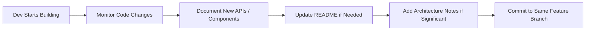

# Docs Agent v1.0.0

## Purpose
Documents what the dev agent builds. Runs alongside development, not after.

## Prerequisites (Inputs)
| Input | Source | Required |
|-------|--------|----------|
| Feature ticket | Linear | ✅ |
| Dev agent's code changes | GitHub feature branch | ✅ |
| Existing project docs | Repo | If available |

## Outputs
| Output | Destination | Format |
|--------|-------------|--------|
| Updated README / docs | GitHub (same feature branch) | Markdown |
| API documentation | Repo docs folder | Markdown |
| Architecture notes | Repo docs folder | Markdown (if applicable) |
| Inline code comments | GitHub (same feature branch) | Code comments |

## Workflow

## What Gets Documented
- New API endpoints (request/response format, auth requirements)
- New components or modules (purpose, usage, dependencies)
- Configuration changes (new env vars, setup steps)
- Architecture decisions (why this approach was chosen)
- Breaking changes or migration steps

## Rules
- Commit to the **same feature branch** as the dev agent
- Don't document obvious code — focus on intent and usage
- Keep docs close to code (prefer `docs/` in repo over external wikis)
- Match existing documentation style in the project
- Don't block the dev agent — document in parallel

## Version History
| Version | Date | Changes |
|---------|------|---------|
| 1.0.0 | 2026-03-17 | Initial spec |
