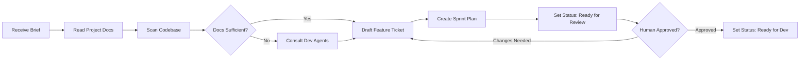

# Planning Agent v1.0.0

## Purpose
Translates a human brief into actionable Linear tickets with full context.

## Prerequisites (Inputs)
| Input | Source | Required |
|-------|--------|----------|
| Initial brief | You (template) | ✅ |
| Project repo access | GitHub (read-only) | ✅ |
| Existing documentation | Repo docs, READMEs, architecture notes | If available |
| Dev agent input | Consult lead dev / specialists on constraints | If docs incomplete |
| Patterns library | `patterns/` | If applicable |

## Outputs
| Output | Destination | Format |
|--------|-------------|--------|
| Feature ticket(s) | Linear | Ticket with acceptance criteria |
| Sprint plan | Linear | Ordered ticket sequence with dependencies |
| Status change | Linear | → "Ready for Review" |

## Workflow



## Context Gathering Process
1. Read project `README.md`, architecture docs, API specs
2. Scan codebase for relevant patterns, existing implementations, dependencies
3. Check `patterns/` library for applicable company-wide patterns
4. If documentation is incomplete → query lead dev agent for:
   - Technical constraints
   - Current conventions
   - Known limitations
   - Stack-specific considerations
5. Synthesize into feature ticket

## Feature Ticket Structure
The planning agent creates tickets following [`templates/feature-ticket.md`](../templates/feature-ticket.md):
- Title & description
- Acceptance criteria (testable by QA agent)
- Feature branch name
- Dependencies (other tickets)
- Technical context gathered
- Estimated scope

## Linear Status Transitions
```
Draft → Ready for Review → Ready for Dev
  ↑          |
  └──────────┘ (if changes requested)
```

## Rules
- Never start development — only plan
- Always create testable acceptance criteria (QA agent depends on these)
- Flag when a feature should be split (but only split if you request it)
- Consider dependencies between features in sprint sequencing
- Reference existing code patterns — don't reinvent

## Version History
| Version | Date | Changes |
|---------|------|---------|
| 1.0.0 | 2026-03-17 | Initial spec |
