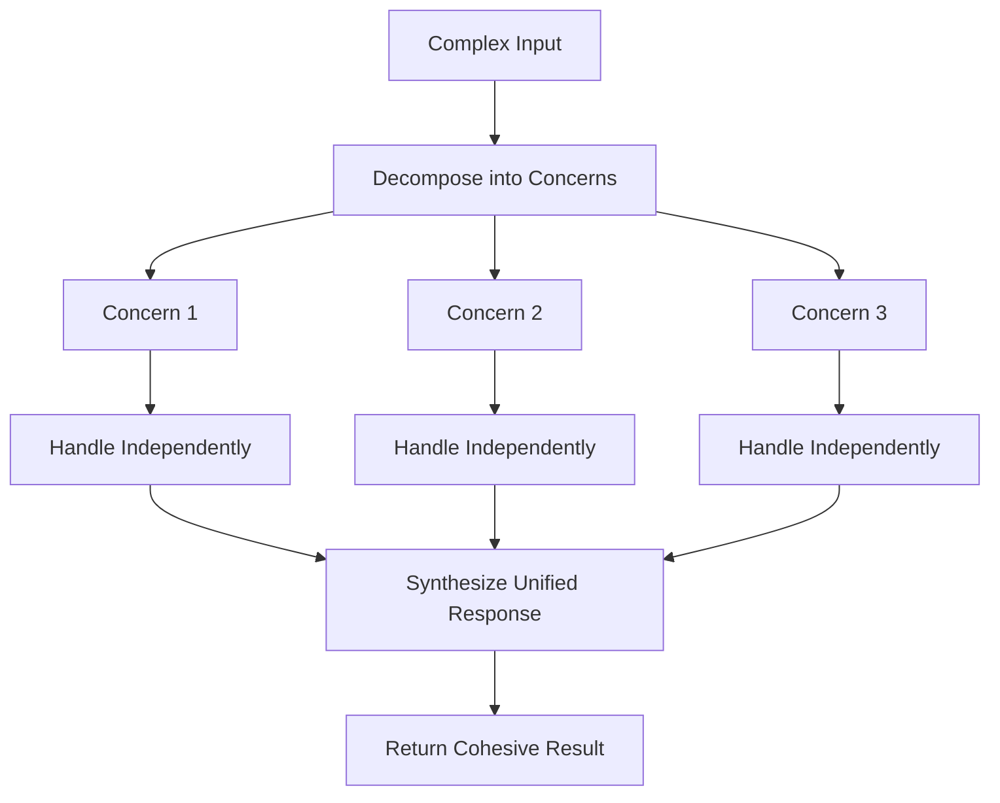

# Agent Runtime — Implementation Spec

The execution engine that powers every agent in the SDLC. This defines how agents run, use tools, handle errors, enforce rules via hooks, and decompose complex tasks.

---

## 1. MCP Tool Definitions

Each tool has a clear description, defined inputs, and explicit boundary conditions. Tools with similar functionality are carefully differentiated to prevent selection confusion.

### Linear Tools

```json
{
  "name": "linear_create_ticket",
  "description": "Create a NEW feature ticket in Linear with title, description, acceptance criteria, and sprint assignment. Use this only when no ticket exists yet for the feature. Do NOT use this to update existing tickets.",
  "input_schema": {
    "type": "object",
    "properties": {
      "title": { "type": "string", "description": "Short descriptive title for the feature" },
      "description": { "type": "string", "description": "Full description including user story" },
      "acceptance_criteria": {
        "type": "array",
        "items": { "type": "string" },
        "description": "List of testable criteria. QA agent validates against these."
      },
      "project_id": { "type": "string", "description": "Linear project ID" },
      "priority": { "type": "string", "enum": ["urgent", "high", "medium", "low"] },
      "branch_name": { "type": "string", "description": "Feature branch name: feature/[ticket-id]-[short-name]" }
    },
    "required": ["title", "description", "acceptance_criteria", "project_id"]
  }
}
```

```json
{
  "name": "linear_update_ticket",
  "description": "Update an EXISTING Linear ticket. Use this to change status, add comments, update description, or modify fields. Do NOT use this to create new tickets — use linear_create_ticket instead.",
  "input_schema": {
    "type": "object",
    "properties": {
      "ticket_id": { "type": "string", "description": "Linear ticket identifier (e.g. GEN-42)" },
      "status": { "type": "string", "enum": ["draft", "ready-for-review", "ready-for-dev", "in-progress", "in-review", "in-qa", "done"] },
      "comment": { "type": "string", "description": "Comment to add to the ticket" },
      "description": { "type": "string", "description": "Updated description (replaces existing)" },
      "add_label": { "type": "string" },
      "remove_label": { "type": "string" }
    },
    "required": ["ticket_id"]
  }
}
```

> **Why two tools?** A single `linear_tool` caused agents to create tickets when they meant to update, and vice versa. Splitting by intent eliminates ambiguity.

### Codebase Tools

```json
{
  "name": "read_project_docs",
  "description": "Read project-level documentation files: README, architecture docs, API specs, and configuration files. Use this for understanding project structure and conventions. Do NOT use this for reading source code — use read_codebase instead.",
  "input_schema": {
    "type": "object",
    "properties": {
      "project_path": { "type": "string" },
      "doc_type": { "type": "string", "enum": ["readme", "architecture", "api-spec", "config", "all"] }
    },
    "required": ["project_path"]
  }
}
```

```json
{
  "name": "read_codebase",
  "description": "Scan source code files to understand implementations, patterns, dependencies, and existing functionality. Use this when you need to understand how something is built. Do NOT use this for documentation — use read_project_docs instead.",
  "input_schema": {
    "type": "object",
    "properties": {
      "project_path": { "type": "string" },
      "scope": { "type": "string", "description": "File pattern or directory to focus on (e.g. 'src/auth/', '**/*.ts')" },
      "purpose": { "type": "string", "description": "What you're looking for (e.g. 'auth pattern', 'database schema')" }
    },
    "required": ["project_path", "purpose"]
  }
}
```

### Test & Run Tools

```json
{
  "name": "run_app_local",
  "description": "Start the application locally for manual testing and verification. Returns the local URL and process status. Use this before running functional tests.",
  "input_schema": {
    "type": "object",
    "properties": {
      "project_path": { "type": "string" },
      "env": { "type": "string", "enum": ["dev", "staging", "test"], "default": "dev" }
    },
    "required": ["project_path"]
  }
}
```

```json
{
  "name": "run_tests",
  "description": "Execute automated test suites against the running application. Returns pass/fail results per test case. The app must be running first — use run_app_local before this tool.",
  "input_schema": {
    "type": "object",
    "properties": {
      "project_path": { "type": "string" },
      "test_scope": { "type": "string", "enum": ["unit", "integration", "functional", "all"] },
      "test_filter": { "type": "string", "description": "Filter to specific test files or patterns" }
    },
    "required": ["project_path", "test_scope"]
  }
}
```

---

## 2. Agentic Loop

The core execution cycle every agent follows.

```python
async def agent_loop(task, tools, max_iterations=50):
    messages = [{"role": "user", "content": task}]
    iteration = 0

    while iteration < max_iterations:
        iteration += 1

        response = await call_llm(messages, tools)

        # Check stop_reason
        if response.stop_reason == "end_turn":
            # Agent is done — return final response
            return extract_text(response)

        elif response.stop_reason == "tool_use":
            # Agent wants to use a tool
            tool_calls = extract_tool_calls(response)

            for tool_call in tool_calls:
                # Run pre-tool hooks (guardrails)
                hook_result = await run_hooks("pre_tool_use", tool_call)
                if hook_result.blocked:
                    # Hook blocked this call — add error to context
                    messages.append(make_tool_error(
                        tool_call.id,
                        hook_result.reason,
                        error_category="permission"
                    ))
                    continue

                # Execute the tool
                result = await execute_tool(tool_call)

                # Run post-tool hooks (logging, validation)
                await run_hooks("post_tool_use", tool_call, result)

                # Handle errors
                if result.is_error:
                    error_response = handle_error(result)
                    messages.append(make_tool_result(
                        tool_call.id,
                        error_response
                    ))
                else:
                    messages.append(make_tool_result(
                        tool_call.id,
                        result.output
                    ))

            # Continue the loop — LLM sees tool results

        elif response.stop_reason == "max_tokens":
            # Response was cut off — continue generation
            messages.append({"role": "assistant", "content": response.content})
            messages.append({"role": "user", "content": "Continue from where you left off."})

    # Max iterations reached — escalate
    return escalate("Max iterations reached", messages)
```

### Termination Conditions

| Condition | Action | Example |
|-----------|--------|---------|
| `end_turn` | Return response | Agent finished writing the ticket |
| `max_tokens` | Continue generation | Long code output got cut off |
| Max iterations | Escalate to you | Dev agent stuck in a loop |
| Hook blocks action | Add error, continue loop | Tried to push to `main` directly |
| Critical error | Escalate to you | Can't access repo at all |

---

## 3. Structured Error Handling

Every tool returns structured errors that the agent can act on.

```json
{
  "success": false,
  "error": {
    "errorCategory": "transient",
    "isRetryable": true,
    "code": "RATE_LIMITED",
    "message": "Linear API rate limit exceeded. Retry after 2 seconds.",
    "retryAfterMs": 2000
  }
}
```

### Error Categories

| Category | `isRetryable` | Agent Behavior | Example |
|----------|--------------|----------------|---------|
| **transient** | `true` | Retry with backoff (max 3 attempts) | API timeout, rate limit, network error |
| **validation** | `false` | Fix the input and retry the tool call | Invalid ticket format, build error, lint failure |
| **permission** | `false` | Escalate to you immediately | Can't access repo, protected branch, auth expired |

### Error Handling Logic

```python
def handle_error(result):
    error = result.error

    if error.errorCategory == "transient" and error.isRetryable:
        if retry_count < 3:
            await sleep(error.retryAfterMs or exponential_backoff(retry_count))
            return retry(tool_call)
        else:
            return escalate("Transient error persists after 3 retries", error)

    elif error.errorCategory == "validation":
        # Return error to LLM so it can fix and retry
        return {
            "is_error": True,
            "content": f"Validation error: {error.message}. Fix the input and try again."
        }

    elif error.errorCategory == "permission":
        # Cannot recover locally
        return escalate(
            f"Permission error: {error.message}",
            recommendation="Check access credentials or branch protection rules"
        )
```

---

## 4. Programmatic Hooks

Hooks intercept tool calls at key lifecycle points to enforce business rules.

### Hook Types

| Hook | When | Purpose |
|------|------|---------|
| `PreToolUse` | Before a tool executes | Block, modify, or log the call |
| `PostToolUse` | After a tool executes | Validate output, log, trigger side effects |
| `Stop` | When agent finishes | Final validation, cleanup |
| `OnEscalation` | When agent escalates | Notify you, log the escalation |

### Example: Branch Protection Hook

```python
async def enforce_branch_protection(tool_call, context):
    """PreToolUse hook: prevent direct pushes to main."""
    if tool_call.name == "git_push":
        branch = tool_call.input.get("branch", "")
        if branch in ["main", "master"]:
            return {
                "blocked": True,
                "reason": "Direct push to main is not allowed. Open a PR instead.",
                "redirect": "git_open_pr"
            }
    return {"blocked": False}
```

### Example: Token Budget Hook

```python
async def enforce_token_budget(tool_call, context):
    """PreToolUse hook: prevent runaway token spend."""
    session_tokens = context.get("total_tokens_used", 0)
    max_budget = 500_000  # per agent run

    if session_tokens > max_budget:
        return {
            "blocked": True,
            "reason": f"Token budget exceeded ({session_tokens:,} / {max_budget:,}). Escalating to human.",
            "escalate": True
        }
    return {"blocked": False}
```

### Example: Acceptance Criteria Gate Hook

```python
async def enforce_acceptance_criteria(tool_call, context):
    """PreToolUse hook: prevent status change to ready-for-dev without AC."""
    if tool_call.name == "linear_update_ticket":
        new_status = tool_call.input.get("status", "")
        if new_status == "ready-for-dev":
            ticket = await get_ticket(tool_call.input["ticket_id"])
            if not ticket.acceptance_criteria or len(ticket.description) < 200:
                return {
                    "blocked": True,
                    "reason": "Cannot move to ready-for-dev: ticket must have acceptance criteria and description > 200 chars."
                }
    return {"blocked": False}
```

### Hook Registration

```python
hooks = {
    "PreToolUse": [
        {"matcher": "git_push", "handler": enforce_branch_protection},
        {"matcher": "*", "handler": enforce_token_budget},
        {"matcher": "linear_update_ticket", "handler": enforce_acceptance_criteria},
    ],
    "PostToolUse": [
        {"matcher": "Edit|Write", "handler": log_file_changes},
        {"matcher": "linear_*", "handler": log_linear_operations},
    ],
    "OnEscalation": [
        {"matcher": "*", "handler": notify_human_via_linear},
    ]
}
```

---

## 5. Multi-Concern Decomposition

When a task contains multiple concerns, the agent decomposes, handles each, and synthesizes.

### How It Works



### Example: Planning Agent with Multi-Feature Brief

**Input:** "I want user auth with OAuth, a dashboard with analytics charts, and an admin panel for user management"

**Decomposition:**
```
Concern 1: User auth with OAuth
  → Ticket: AUTH-001 — Implement OAuth login flow
  → Dependencies: none

Concern 2: Dashboard with analytics
  → Ticket: DASH-001 — Build analytics dashboard
  → Dependencies: AUTH-001 (needs logged-in user)

Concern 3: Admin panel
  → Ticket: ADMIN-001 — Admin user management panel
  → Dependencies: AUTH-001 (needs role-based auth)
```

**Synthesis:**
```
Sprint Plan:
  1. AUTH-001 (no dependencies — start first)
  2. DASH-001 + ADMIN-001 (parallel — both depend on AUTH-001)

→ Creates 3 Linear tickets
→ Sets dependency links
→ Orders sprint sequence
→ Returns unified summary for your review
```

### Example: QA Agent with Multi-Issue Test Results

**Input:** PR with 3 acceptance criteria

**Decomposition:**
```
Criterion 1: "User can log in with Google OAuth" → Test independently
Criterion 2: "Dashboard shows 30-day chart" → Test independently
Criterion 3: "Admin can disable a user account" → Test independently
```

**Synthesis:**
```
QA Report — PR #42
  Criterion 1: ✅ Pass — OAuth login works with Google
  Criterion 2: ❌ Fail — Chart renders but shows 7 days not 30
  Criterion 3: ✅ Pass — Admin disable works correctly

Overall: FAIL (1 of 3 criteria failed)
Action: Back to dev with comment on Criterion 2
```

---

## Putting It All Together

A single agent run through the full runtime:

```
1. Receive task (from Linear status change or your brief)
2. Enter agentic loop
3. LLM decides which tool to call
4. PreToolUse hooks run → check guardrails
   → Blocked? Add error to context, continue loop
   → Allowed? Execute tool
5. Tool executes → returns result or structured error
6. Error handling:
   → Transient? Retry (max 3)
   → Validation? Feed error to LLM, let it fix
   → Permission? Escalate
7. PostToolUse hooks run → log, validate
8. Append result to messages
9. Back to step 3 (LLM sees results, decides next action)
10. Loop until:
    → end_turn (task complete)
    → max iterations (escalate)
    → critical error (escalate)
11. Return final response or escalation
```

---

*This spec defines the runtime behavior. Each agent (Planning, Dev, QA) uses this same engine with different tools, hooks, and termination criteria.*
