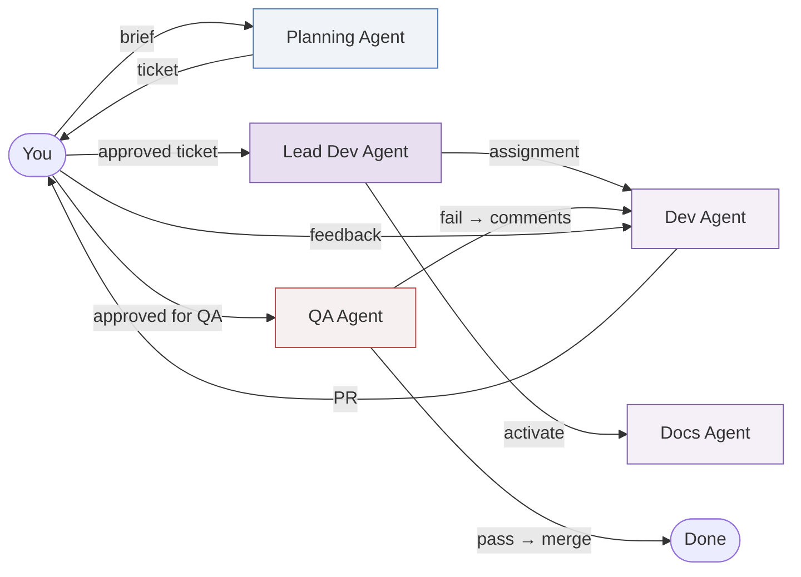

# Agent Versioning

Every agent in the system is versioned. This tracks what built what, and allows controlled upgrades.

## Version Format

`MAJOR.MINOR.PATCH` (semver)

- **MAJOR** — fundamental change to agent's role or orchestration position
- **MINOR** — new capability added (e.g., QA agent gains performance testing)
- **PATCH** — prompt refinement, bug fix in behavior

## Agent Registry

| Agent | Current Version | Spec Location |
|-------|-----------------|---------------|
| Planning Agent | v1.0.0 | [`agents/planning-agent.md`](../agents/planning-agent.md) |
| Lead Dev Agent | v1.0.0 | [`agents/lead-dev-agent.md`](../agents/lead-dev-agent.md) |
| Dev Agent | v1.0.0 | [`agents/dev-agent.md`](../agents/dev-agent.md) |
| Docs Agent | v1.0.0 | [`agents/docs-agent.md`](../agents/docs-agent.md) |
| QA Agent | v1.0.0 | [`agents/qa-agent.md`](../agents/qa-agent.md) |

## What Each Spec Contains

Every agent spec documents:
1. **Purpose** — what the agent does
2. **Prerequisites (Inputs)** — what it needs to start
3. **Outputs** — what it produces and where
4. **Workflow flowchart** — visual of its internal process
5. **Rules** — constraints on behavior
6. **Version history** — changelog

## Orchestration Map

## Tracking

When a feature is built, the Linear ticket should note which agent versions were used. This enables:
- Debugging — "this was built by dev-agent v1.0.0, which had [known issue]"
- A/B comparison — "v1.1.0 of QA agent catches 20% more issues"
- Rollback — if a new agent version performs worse, revert to prior version
