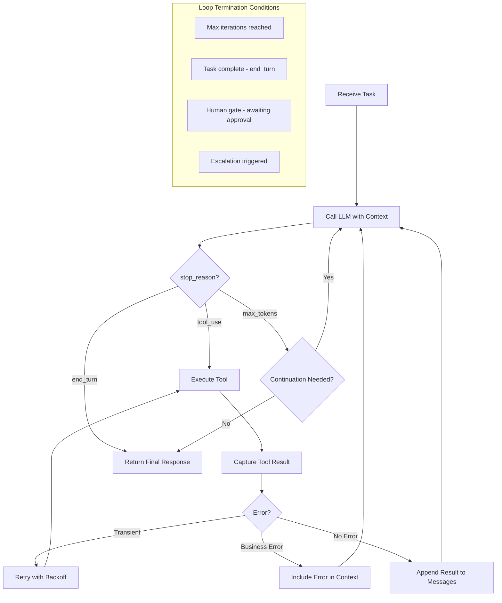
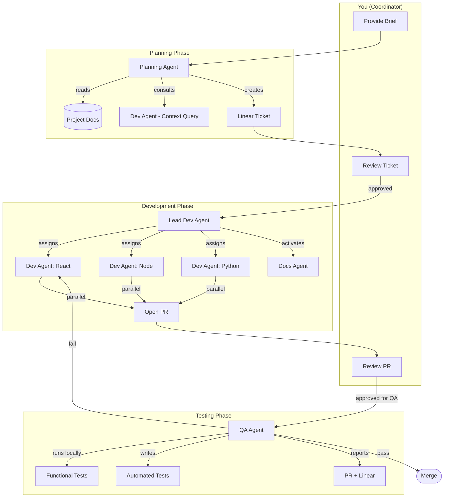
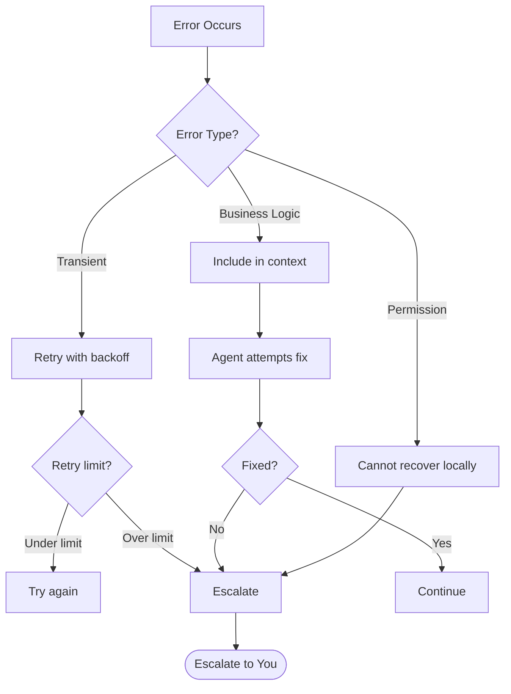
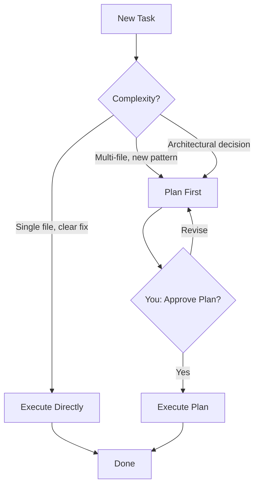

# Agentic Architecture Patterns

How each pattern applies to our development workflow.

---

## 1. Agentic Loop Implementation

The core execution cycle every agent follows.



**Our agents:**
- **Planning Agent** loops until ticket is fully specified → stops at `end_turn`
- **Dev Agent** loops through read → edit → test cycles → stops when PR is ready
- **QA Agent** loops through test execution → stops on pass/fail determination
- All agents have **max iteration limits** to prevent runaway token burn

---

## 2. Multi-Agent Orchestration

How our agents coordinate through Linear.



### Task Decomposition
```
Brief → Planning Agent breaks into:
  ├── Feature Ticket (with acceptance criteria)
  ├── Sprint Plan (ordered sequence)
  └── Dependency Map (what blocks what)

Feature Ticket → Lead Dev breaks into:
  ├── Specialist Assignment (stack-based)
  ├── Docs Agent Activation
  └── Branch + Environment Setup
```

### Parallel Subagent Execution
- Dev Agent + Docs Agent run **simultaneously** on the same feature branch
- Multiple specialist dev agents can work **parallel features** within a sprint
- QA Agent runs **parallel test suites** (functional, automated)

### Iterative Refinement Loops
```
Dev ←→ QA Loop:
  Dev builds → QA tests → Fail → QA comments → Dev reads feedback
  → Dev fixes (same branch) → QA re-tests → ...repeat until pass

Dev ←→ You Loop:
  Dev builds → You review → Feedback → Dev reads your comments
  → Dev fixes (same branch) → You re-review → ...repeat until approved
```

---

## 3. Subagent Context Management

How agents maintain awareness across handoffs and iterations.

### Explicit Context Passing
Each agent receives a **structured context package** when activated:

```
Planning Agent receives:
  ├── Your brief (initial-brief.md)
  ├── Project repo path
  ├── Existing docs index
  └── Patterns library reference

Dev Agent receives:
  ├── Linear ticket (full description + acceptance criteria)
  ├── Feature branch name
  ├── Prior commits on branch (if returning from QA)
  ├── QA feedback comments
  ├── Your feedback comments
  └── Project conventions doc

QA Agent receives:
  ├── PR reference
  ├── Linear ticket (acceptance criteria = test plan)
  ├── Previous QA cycle results (if re-testing)
  └── App run instructions
```

### Structured State Persistence
State lives in **Linear tickets** and **Git**, not in agent memory:

| State | Where It Lives | Why |
|-------|---------------|-----|
| Requirements | Linear ticket description | Survives agent restarts |
| Code progress | Git branch commits | Versioned, reviewable |
| QA results | PR comments + Linear comments | Visible to all agents |
| Your feedback | PR comments + Linear comments | Same channel as QA |
| Sprint plan | Linear project board | Single source of truth |

### Crash Recovery
If an agent crashes mid-task:
1. **Git** preserves all committed work on the feature branch
2. **Linear ticket** preserves the full context (description, comments, status)
3. New agent instance reads ticket + branch state → resumes from last known good state
4. No work is lost because state is external, not in agent memory

---

## 4. Tool Interface Design

How agents interact with external systems.

### Tool Categories

| Tool | Type | Agent(s) | Purpose |
|------|------|----------|---------|
| `linear-create-ticket` | Action | Planning | Create feature tickets |
| `linear-update-status` | Action | All | Move tickets between columns |
| `linear-add-comment` | Action | QA, Dev | Post feedback/results |
| `git-create-branch` | Action | Dev | Create feature branches |
| `git-commit` | Action | Dev, Docs | Commit changes |
| `git-open-pr` | Action | Dev | Open pull requests |
| `run-app-local` | Action | QA | Start app for testing |
| `run-tests` | Action | QA | Execute test suites |
| `read-project-docs` | Resource | Planning | Gather project context |
| `read-codebase` | Resource | Planning, Dev | Scan existing code |
| `read-patterns-library` | Resource | Planning, Dev | Reference company patterns |

### Tool Design Principles
- **Split tools by action** — `linear-create-ticket` and `linear-update-status` are separate, not one `linear-do-everything`
- **Descriptive names** — `read-project-docs` not `get-data`
- **Clear input schemas** — agents know exactly what parameters to provide
- **Structured outputs** — tools return consistent JSON, not free text

---

## 5. MCP Tool & Resource Design

### Resources (read-only context)
Used for content catalogs that agents reference:
- Project documentation
- Patterns library
- Linear ticket details
- Codebase structure

### Tools (actions that change state)
Used for operations that modify things:
- Creating/updating Linear tickets
- Git operations (branch, commit, PR)
- Running tests
- Deploying

### Description Quality
Each tool has a clear description so agents select the right one:
```
✅ "Create a new Linear ticket with title, description, and acceptance
    criteria in the specified project"
❌ "Linear tool"
```

---

## 6. Error Handling & Propagation



**Error types in our workflow:**
- **Transient:** API rate limits, network timeouts, Linear API 429s → retry
- **Business Logic:** Test failures, lint errors, build failures → agent fixes locally
- **Permission:** Can't access repo, can't merge to protected branch → escalate to you

**Rule:** Always try local recovery before escalation.

---

## 7. Escalation Decision-Making

When an agent should stop trying and ask for help.

### Explicit Criteria

| Agent | Escalate When |
|-------|--------------|
| **Planning Agent** | Requirements ambiguous, can't determine scope, conflicting constraints |
| **Dev Agent** | Blocked by infrastructure, needs access/permissions, fundamental design question |
| **QA Agent** | Critical defect found, same bug recurring 3+ cycles, acceptance criteria ambiguous |
| **Lead Dev** | Specialist agent stuck, wrong specialist assigned, architectural concern |

### Honoring Preferences
- You are the **only** escalation target (no direct client contact)
- Escalations go to **Linear ticket comments** (same channel as all other communication)
- Agent includes: what it tried, why it failed, what it recommends

### Policy Gap Identification
When an agent encounters a situation not covered by its rules:
1. Document the gap in the ticket
2. Escalate with a recommendation
3. You decide → the decision becomes a new pattern in `patterns/`

---

## 8. Context Window Optimization

### Trimming Verbose Tool Outputs
- Git diffs: only include changed files relevant to the ticket
- Test results: summary first, full output available if needed
- Linear ticket: strip metadata, keep description + comments

### Structured Fact Extraction
When the planning agent reads a large codebase:
1. Don't dump entire files into context
2. Extract: file purposes, exports, dependencies, patterns used
3. Summarize into a structured brief for the ticket

### Position-Aware Input Ordering
```
[Long context: project docs, codebase summary]    ← TOP
[Medium context: ticket description, comments]     ← MIDDLE
[Short context: current task instruction]          ← BOTTOM (most recent)
```
Keeps the actionable instruction closest to where the model generates its response.

---

## 9. Plan Mode vs Direct Execution

### When to Plan First
- New feature spanning multiple files/components
- Architecture decisions (new patterns, tech choices)
- Sprint planning (ordering, dependencies)
- Any task estimated as Medium or Large

### When to Execute Directly
- Single-file bug fixes
- Documentation updates
- Simple config changes
- Automated test additions for existing features



---

## 10. Iterative Refinement

### Input/Output Examples
Planning agent uses examples from past successful tickets to learn the expected format and depth.

### Test-Driven Iteration (QA Loop)
```
QA writes tests from acceptance criteria FIRST
  → Runs tests (expect fail on new feature)
    → Dev builds until tests pass
      → QA verifies behavior manually
        → Pass or loop
```

### Interview Pattern
Planning agent can "interview" dev agents for context:
```
Planning: "What auth pattern does this project use?"
Dev: "JWT with refresh tokens, middleware in /lib/auth.ts"
Planning: → incorporates into ticket technical context
```

### Sequential vs Parallel Issue Resolution
- **Sequential:** Bug A blocks Bug B → fix A first, then B
- **Parallel:** Bug A and Bug B are independent → two dev agents work simultaneously

---

## 11. Human Review Workflows

### Confidence Calibration
Agents signal confidence in their output:
- **High:** "Ready for review" — straightforward implementation
- **Medium:** "Review recommended" — edge cases or assumptions made
- **Low:** "Needs discussion" — multiple approaches possible, chose one

### Your Review Points
```
Gate 1: Feature ticket review
  → Check: Are acceptance criteria testable?
  → Check: Is scope appropriate?
  → Check: Are dependencies identified?

Gate 2: Implementation review
  → Check: Does it match the ticket?
  → Check: Code quality acceptable?
  → Check: Any concerns for QA to focus on?
```

---

## 12. Information Provenance

### Claim-Source Mappings
When the planning agent gathers context, it tracks where information came from:
```
"Uses PostgreSQL" → source: README.md, line 23
"Auth via JWT" → source: /lib/auth.ts (code inspection)
"Max 100 items per page" → source: Dev agent consultation
```

### Conflict Annotation
When sources disagree:
```
⚠️ CONFLICT: README says "MySQL" but docker-compose.yml shows PostgreSQL
→ Agent flags for your resolution before proceeding
```

### Coverage Gap Reporting
Planning agent reports what it couldn't find:
```
✅ Found: tech stack, auth pattern, API structure
❌ Missing: deployment process, environment variables, rate limits
→ Flagged as gaps in the ticket's technical context section
```

---

## Pattern Summary

| Pattern | Primary Agent | When Applied |
|---------|--------------|--------------|
| Agentic Loop | All | Every agent execution cycle |
| Orchestrator-Workers | Lead Dev → Specialists | Development phase |
| Evaluator-Optimizer | Dev ↔ QA | Testing feedback loop |
| Prompt Chaining | Planning → Dev → QA | Full lifecycle flow |
| Routing | Lead Dev | Assigning stack specialists |
| Parallelization | Dev + Docs, multiple features | Sprint execution |
| Plan-then-Execute | Planning Agent | Requirements gathering |
| Direct Execution | Dev Agent | Single-file fixes |

---

*Based on Anthropic's "Building Effective Agents" patterns, adapted for our agentic SDLC.*
