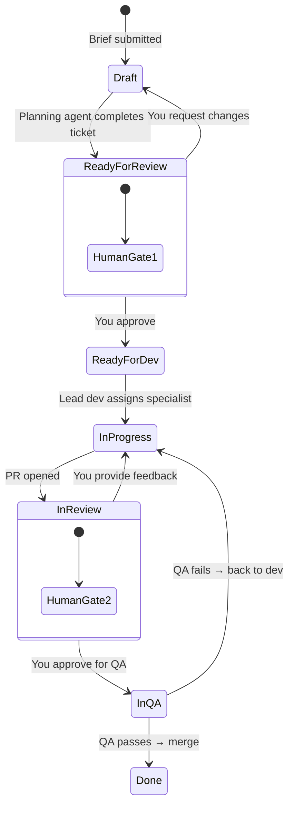

# Linear Workflow

Linear is the single source of truth for all project work.

## Board Columns

| Column | Owner | Entry Condition | Exit Condition |
|--------|-------|-----------------|----------------|
| **Draft** | Planning Agent | Brief received | Ticket fully specified |
| **Ready for Review** | You | Ticket has acceptance criteria, branch name, context | You approve |
| **Ready for Dev** | Lead Dev Agent | You approved | Lead dev assigns specialist |
| **In Progress** | Dev Agent | Specialist assigned | PR opened |
| **In Review** | You | PR opened | You approve for QA |
| **In QA** | QA Agent | You approve implementation | QA passes all criteria |
| **Done** | — | QA approved + PR merged | — |

## Status Transitions

## Labels

| Label | Usage |
|-------|-------|
| `feature` | New functionality |
| `bug` | Defect found in QA or production |
| `chore` | Infrastructure, tooling, config |
| `docs` | Documentation only |

## Conventions

- **One ticket per feature** — split only when explicitly requested
- **Acceptance criteria are mandatory** — QA tests against them
- **Feature branch name defined in ticket** — `feature/[ticket-id]-[short-name]`
- **All feedback lives on the ticket** — QA reports, your comments, dev responses
- **Sprint plan = ordered sequence** — planning agent handles dependency ordering
