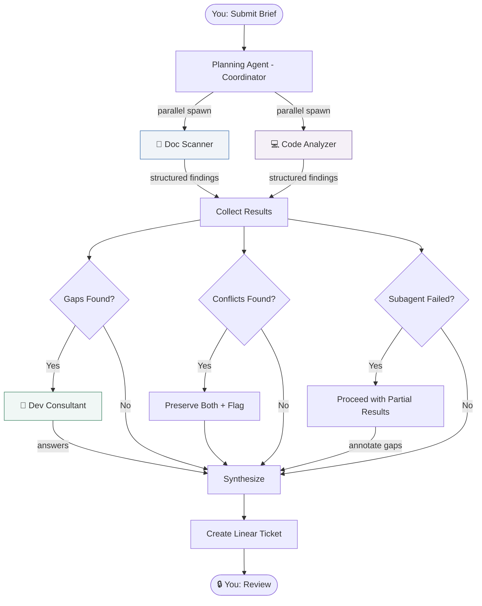
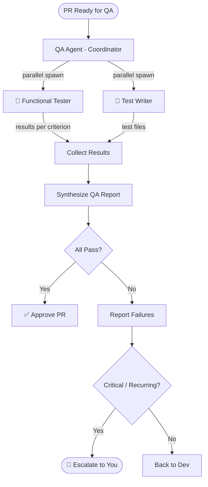

# Multi-Agent Research Pipeline

How the Planning Agent and QA Agent use subagent orchestration, context passing, provenance tracking, and error propagation.

---

## Planning Agent as Research Pipeline

The Planning Agent is a coordinator that delegates context gathering to parallel subagents before synthesizing a feature ticket.



### Subagent Definitions

Each subagent receives its task explicitly in its prompt — no automatic context inheritance.

#### Doc Scanner (Subagent 1)

```
Task: "Read all project documentation and extract:
  - Technology stack with versions
  - Architecture patterns and conventions
  - API contracts and data models
  - Configuration and environment requirements
  
  Return structured findings. Each finding must include
  the claim, evidence excerpt, and source file with line number."

Tools: [Read, Glob]
Context: fork (isolated)
```

#### Code Analyzer (Subagent 2)

```
Task: "Scan the codebase at {project_path} and extract:
  - Existing modules relevant to: {feature_description}
  - Code patterns used (auth, data fetching, state management)
  - Dependencies that affect this feature
  - File structure and naming conventions
  
  Return structured findings. Each finding must include
  the claim, evidence excerpt, and source file:line."

Tools: [Read, Glob, Grep]
Context: fork (isolated)
```

#### Dev Consultant (Subagent 3 — conditional)

Only spawned when Doc Scanner + Code Analyzer leave gaps.

```
Task: "The following questions could not be answered from
  documentation or code analysis:
  
  1. {gap_1}
  2. {gap_2}
  
  Based on your knowledge of this project's codebase,
  provide answers with explanations. If you don't know,
  say so explicitly."

Tools: [Read, Glob, Grep]
Context: fork (isolated)
```

### Parallel Execution

Doc Scanner and Code Analyzer run simultaneously because they have no dependencies on each other:

```python
# Coordinator emits multiple Task tool calls in one response
tool_calls = [
    {
        "name": "Task",
        "input": {
            "agent": "doc-scanner",
            "prompt": doc_scanner_task,
            "allowed_tools": ["Read", "Glob"]
        }
    },
    {
        "name": "Task",
        "input": {
            "agent": "code-analyzer",
            "prompt": code_analyzer_task,
            "allowed_tools": ["Read", "Glob", "Grep"]
        }
    }
]
# Both execute in parallel — coordinator waits for both to complete
```

Sequential fallback: Dev Consultant only runs after gaps are identified from the first two.

---

## Structured Output Format

Every subagent returns findings in a consistent format that separates content from metadata.

### Finding Schema

```json
{
  "findings": [
    {
      "claim": "Authentication uses JWT with refresh tokens",
      "evidence": "export const verifyToken = (token: string) => jwt.verify(token, SECRET)",
      "source": "src/lib/auth.ts",
      "source_line": 14,
      "source_type": "code",
      "confidence": "high",
      "date_observed": "2026-03-18"
    },
    {
      "claim": "Project uses Next.js 14 with App Router",
      "evidence": "\"next\": \"14.2.33\"",
      "source": "package.json",
      "source_line": 8,
      "source_type": "config",
      "confidence": "high",
      "date_observed": "2026-03-18"
    }
  ],
  "coverage": {
    "found": ["tech_stack", "auth_pattern", "database", "api_structure"],
    "missing": ["deployment_process", "env_variables", "rate_limits"]
  },
  "errors": []
}
```

### Conflict Schema

When two sources disagree:

```json
{
  "claim": "Database is PostgreSQL",
  "evidence": "image: postgres:15-alpine",
  "source": "docker-compose.yml",
  "source_line": 8,
  "confidence": "high",
  "conflicts_with": {
    "claim": "Database is MySQL",
    "evidence": "We use MySQL for data storage",
    "source": "README.md",
    "source_line": 22,
    "resolution": "unresolved",
    "note": "README may be outdated — docker-compose is more authoritative"
  }
}
```

**Rule:** Never silently pick one. Both values preserved with attribution. Coordinator flags for your resolution.

---

## Error Propagation

### Subagent Timeout

```json
{
  "findings": [],
  "coverage": {
    "found": [],
    "missing": ["all — analysis did not complete"]
  },
  "errors": [
    {
      "type": "timeout",
      "subagent": "code-analyzer",
      "attempted_query": "Scan src/ for auth and data patterns",
      "duration_ms": 30000,
      "partial_results": [
        {
          "claim": "Found 247 TypeScript files before timeout",
          "source": "glob scan (partial)",
          "confidence": "low"
        }
      ],
      "recommendation": "Narrow scope to specific directories (e.g. src/api/, src/lib/)"
    }
  ]
}
```

### Coordinator Handles Partial Results

```python
# Coordinator receives results from all subagents
doc_results = await get_result("doc-scanner")      # ✅ Success
code_results = await get_result("code-analyzer")    # ❌ Timed out

# Proceed with what we have
all_findings = doc_results.findings

# Include partial results from failed subagent
if code_results.errors:
    for error in code_results.errors:
        if error.partial_results:
            all_findings.extend(error.partial_results)

# Annotate gaps in the ticket
coverage_gaps = doc_results.coverage.missing + code_results.coverage.missing
gap_annotation = format_coverage_gaps(coverage_gaps, code_results.errors)

# Create ticket with provenance and gap annotations
ticket = synthesize_ticket(
    findings=all_findings,
    conflicts=find_conflicts(all_findings),
    gaps=gap_annotation,
    errors=code_results.errors
)
```

### Error Types

| Error | Subagent Behavior | Coordinator Behavior |
|-------|-------------------|---------------------|
| **Timeout** | Returns partial results + error | Proceeds with partials, annotates gaps |
| **File not found** | Reports missing file | Notes in coverage gaps |
| **Permission denied** | Returns structured error | Escalates to you if critical |
| **Rate limit** | Retries (transient) | Waits, retries subagent if all fail |

---

## Synthesis with Provenance

The coordinator synthesizes all subagent findings into the Linear ticket, preserving every source.

### Ticket Technical Context Section

```markdown
## Technical Context

### Established Facts
- **Stack:** Next.js 14.2.33 with App Router [package.json:8]
- **Auth:** JWT with refresh tokens [src/lib/auth.ts:14]
- **API:** REST with zod validation [src/api/middleware.ts:3]
- **State:** React Query for server state [src/lib/query-client.ts:1]

### Contested / Conflicting
- **Database:** 
  - PostgreSQL 15 [docker-compose.yml:8] ← likely current
  - MySQL [README.md:22] ← possibly outdated
  - ⚠️ Needs your confirmation before proceeding

### Coverage Gaps
- ❌ Deployment process — not documented, not found in code
- ❌ Environment variables — no .env.example found
- ❌ Rate limiting — no middleware detected
- ⚠️ Code analysis was partial (timeout after 247/~400 files)

### Sources Consulted
| Source | Status | Findings |
|--------|--------|----------|
| README.md | ✅ Read | 3 findings |
| package.json | ✅ Read | 2 findings |
| docker-compose.yml | ✅ Read | 1 finding |
| src/lib/ | ✅ Scanned | 4 findings |
| src/api/ | ⚠️ Partial | 1 finding (timeout) |
| Dev Agent | ❌ Not consulted | No gaps required it |
```

---

## QA Agent as Research Pipeline

The same pattern applies to QA, with test criteria as the research questions.



### QA Subagent Output

```json
{
  "criterion": "User can log in with Google OAuth",
  "status": "pass",
  "evidence": {
    "action": "Clicked 'Sign in with Google', completed OAuth flow",
    "result": "Redirected to dashboard, user session created",
    "source": "manual test — localhost:3000/login"
  },
  "automated_test": {
    "file": "tests/auth/oauth-login.test.ts",
    "assertions": 3,
    "passing": 3
  }
}
```

```json
{
  "criterion": "Dashboard shows 30-day analytics chart",
  "status": "fail",
  "evidence": {
    "action": "Navigated to /dashboard after login",
    "result": "Chart renders but shows 7-day range, not 30-day",
    "source": "manual test — localhost:3000/dashboard",
    "screenshot_ref": "qa-screenshot-001.png"
  },
  "automated_test": {
    "file": "tests/dashboard/chart-range.test.ts",
    "assertions": 2,
    "passing": 1,
    "failing": ["Expected dateRange to be '30d', received '7d'"]
  },
  "severity": "medium",
  "cycle": 1
}
```

### QA Synthesis Report

```markdown
## QA Report — GEN-42: Analytics Dashboard

**Cycle:** 1
**Status:** ❌ FAIL (2/3 criteria passed)

### Results
| # | Criterion | Status | Source |
|---|-----------|--------|--------|
| 1 | Google OAuth login | ✅ Pass | Manual + automated test |
| 2 | 30-day analytics chart | ❌ Fail | Chart shows 7-day range |
| 3 | Admin user disable | ✅ Pass | Manual + automated test |

### Automated Tests Added
- `tests/auth/oauth-login.test.ts` (3 assertions, all passing)
- `tests/dashboard/chart-range.test.ts` (2 assertions, 1 failing)
- `tests/admin/disable-user.test.ts` (2 assertions, all passing)

### Failure Detail
**Criterion 2:** Dashboard chart renders 7-day range instead of 30-day.
- File: `src/components/AnalyticsChart.tsx:47`
- Current: `const range = '7d'`
- Expected: `const range = '30d'` (per acceptance criteria)

### Escalation: None
First cycle failure. Returning to dev for fix.
```

---

## Summary: Where Each Concept Fires

| Concept | Planning Agent | QA Agent |
|---------|---------------|----------|
| **Coordinator + subagents** | Planning → Doc Scanner + Code Analyzer | QA → Functional Tester + Test Writer |
| **Parallel execution** | Doc + Code run simultaneously | Tests + test writing run simultaneously |
| **Explicit context passing** | Each subagent gets its own task prompt | Each subagent gets specific criteria |
| **Structured output** | Findings with claim/evidence/source | Results with criterion/status/evidence |
| **Provenance tracking** | Every fact traced to file:line | Every result traced to test + manual verification |
| **Conflict handling** | Both values preserved, flagged for you | N/A (tests are binary pass/fail) |
| **Error propagation** | Timeout → partial results + gap annotation | Test env down → structured error + escalation |
| **Synthesis** | Ticket with established/contested/gaps sections | QA report with per-criterion results |

---

*This pipeline pattern is the core intelligence behind the Planning and QA agents. The Dev Agent is simpler — it's a single agent with tools, not a research coordinator.*
