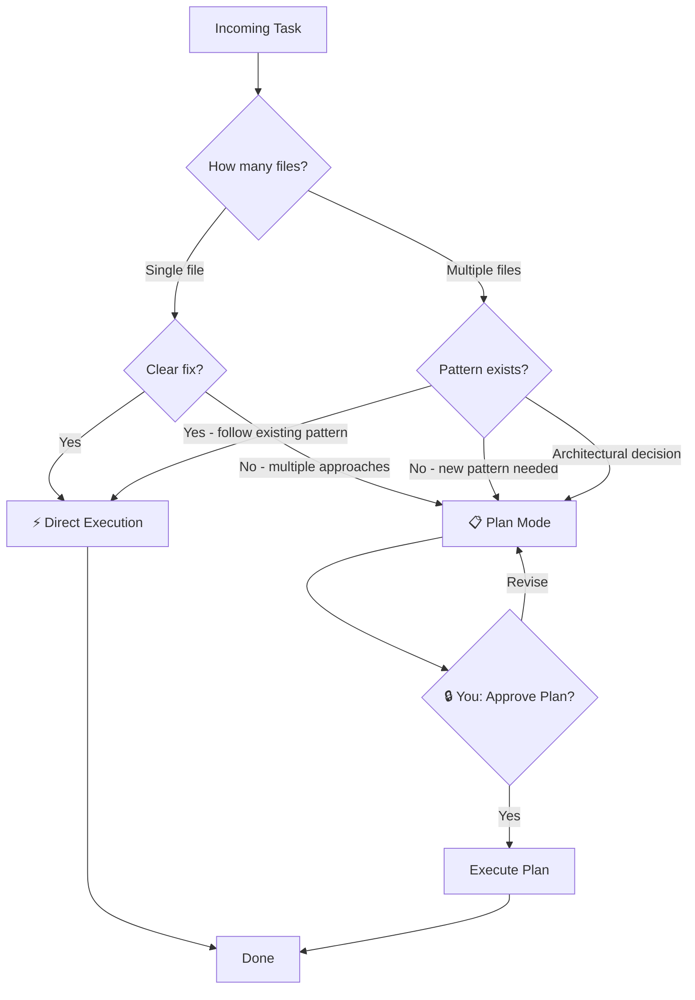

# Project Agent Configuration

How to configure a project repo so agents follow consistent rules, use the right tools, and operate within defined boundaries.

---

## 1. CLAUDE.md — Project-Level Standards

Every project repo includes a root `CLAUDE.md` that all agents inherit.

```markdown
# CLAUDE.md

## Coding Standards
- TypeScript strict mode enabled
- ESLint + Prettier enforced on all files
- No `any` types — use explicit types or generics
- Prefer named exports over default exports
- Max file length: 300 lines (split if larger)

## Git Conventions
- Branch naming: `feature/[TICKET-ID]-[short-name]`
- Commit format: `feat: [TICKET-ID] short description`
- No direct commits to `main` — always use PRs
- Squash merge PRs

## Testing Conventions
- Every feature must have corresponding tests
- Test files: `[filename].test.ts` colocated with source
- Minimum coverage: 80% for new code
- Use `describe` / `it` structure with clear test names

## Architecture
- API routes in `src/api/`
- Shared components in `src/components/`
- Business logic in `src/lib/`
- Types in `src/types/`

## Agent Rules
- Always read this file before starting work
- Reference the Linear ticket for acceptance criteria
- Do not modify files outside the ticket scope
- Run tests before opening a PR
```

### Hierarchy

```
~/.claude.md              ← User-level (personal preferences)
  └── project/CLAUDE.md   ← Project-level (team standards)
       └── project/src/api/CLAUDE.md  ← Directory-level (API-specific rules)
```

Lower levels override higher levels. Agent sees the merged result for the file it's editing.

---

## 2. Path-Specific Rules (.claude/rules/)

Rules that only activate when the agent works on matching files.

### API Conventions

```yaml
# .claude/rules/api-conventions.md
---
paths: ["src/api/**/*"]
---

## API Development Rules
- All endpoints must validate input with zod schemas
- Return consistent response format: { data, error, meta }
- Include rate limiting middleware on public endpoints
- Log all requests with correlation IDs
- Error responses use structured format: { code, message, details }
- Authentication middleware required on all non-public routes
```

### Test Conventions

```yaml
# .claude/rules/test-conventions.md
---
paths: ["**/*.test.*", "**/*.spec.*", "tests/**/*"]
---

## Testing Rules
- Each test file tests ONE module
- Use descriptive test names: "should [expected behavior] when [condition]"
- Mock external dependencies (APIs, databases)
- No test interdependence — each test runs in isolation
- Include edge cases: empty inputs, null values, boundary conditions
- Arrange-Act-Assert pattern for all tests
```

### Component Conventions

```yaml
# .claude/rules/component-conventions.md
---
paths: ["src/components/**/*"]
---

## Component Rules
- One component per file
- Props interface defined and exported
- Use composition over inheritance
- Accessible by default (aria attributes, keyboard navigation)
- Responsive — mobile-first approach
- No inline styles — use CSS modules or Tailwind
```

### Database & Schema

```yaml
# .claude/rules/database-conventions.md
---
paths: ["src/db/**/*", "prisma/**/*", "migrations/**/*"]
---

## Database Rules
- All schema changes require a migration file
- Never modify existing migrations — create new ones
- Index foreign keys and frequently queried columns
- Use soft deletes (deletedAt timestamp) unless space-critical
- Naming: snake_case for tables and columns
```

**How it works:** When a dev agent opens `src/api/users.ts`, it sees the project CLAUDE.md + api-conventions rules. When it opens `src/components/Button.tsx`, it sees project CLAUDE.md + component-conventions. Rules load only for matching paths.

---

## 3. Agent Skills (.claude/skills/)

Skills run in isolated context (fork mode) with restricted tools.

### Planning Skill

```yaml
# .claude/skills/gather-context.md
---
description: "Gather project context for requirements planning"
context: fork
allowed-tools:
  - Read
  - Glob
  - Grep
  - WebFetch
---

## Context Gathering

1. Read the project README.md for high-level architecture
2. Scan src/ directory structure to understand module organization
3. Read package.json for dependencies and scripts
4. Search for existing patterns related to the feature brief
5. Compile findings into a structured context summary

Output format:
- Tech stack with versions
- Relevant existing modules
- Patterns to follow
- Constraints discovered
- Gaps (what couldn't be determined)
```

### Code Review Skill

```yaml
# .claude/skills/code-review.md
---
description: "Review code changes against acceptance criteria"
context: fork
allowed-tools:
  - Read
  - Glob
  - Grep
---

## Code Review

1. Read the Linear ticket acceptance criteria
2. Read all changed files in the PR
3. For each acceptance criterion:
   - Verify the code addresses it
   - Check for edge cases
   - Verify test coverage
4. Check code against project conventions (CLAUDE.md)
5. Report: criteria met/unmet, issues found, recommendations
```

### Test Writing Skill

```yaml
# .claude/skills/write-tests.md
---
description: "Write automated tests for a feature"
context: fork
allowed-tools:
  - Read
  - Write
  - Glob
  - Grep
  - Bash
---

## Test Writing

1. Read the acceptance criteria from the Linear ticket
2. Read the implementation code
3. For each criterion, write a test that:
   - Verifies the happy path
   - Tests at least one edge case
   - Tests error handling
4. Run the tests to verify they pass
5. Report coverage for new code
```

**Why `context: fork`?** Skills run in isolation so they don't pollute the main agent's context window. A code review skill might read 50 files — you don't want that filling up the dev agent's main context.

---

## 4. MCP Server Configuration

### Project-Level (.mcp.json)

Shared tools available to all agents working on this project.

```json
{
  "mcpServers": {
    "linear": {
      "command": "npx",
      "args": ["-y", "@linear/mcp-server"],
      "env": {
        "LINEAR_API_KEY": "${LINEAR_API_KEY}"
      }
    },
    "github": {
      "command": "npx",
      "args": ["-y", "@github/mcp-server"],
      "env": {
        "GITHUB_TOKEN": "${GITHUB_TOKEN}"
      }
    },
    "postgres": {
      "command": "npx",
      "args": ["-y", "@modelcontextprotocol/server-postgres"],
      "env": {
        "DATABASE_URL": "${DATABASE_URL}"
      }
    }
  }
}
```

### User-Level (~/.claude.json)

Personal or experimental tools available alongside project tools.

```json
{
  "mcpServers": {
    "filesystem": {
      "command": "npx",
      "args": ["-y", "@modelcontextprotocol/server-filesystem", "/home/user/projects"]
    },
    "experimental-search": {
      "command": "node",
      "args": ["~/tools/custom-search-server.js"],
      "env": {
        "SEARCH_API_KEY": "${SEARCH_API_KEY}"
      }
    }
  }
}
```

### How They Merge

```
Agent starts working on project:
  ├── Loads ~/.claude.json MCP servers (user-level)
  ├── Loads project/.mcp.json MCP servers (project-level)
  └── All servers available simultaneously

Available tools:
  ├── linear_* (from project .mcp.json)
  ├── github_* (from project .mcp.json)
  ├── postgres_* (from project .mcp.json)
  ├── filesystem_* (from user ~/.claude.json)
  └── experimental_search (from user ~/.claude.json)
```

**Environment variable expansion:** Credentials stay in `.env` files or system env — never hardcoded in config. The `${VAR_NAME}` syntax pulls from the environment at runtime.

---

## 5. Plan Mode vs Direct Execution

### Decision Framework



### When to Use Each

| Scenario | Mode | Why |
|----------|------|-----|
| Fix typo in README | Direct | Trivial, no ambiguity |
| Fix a known bug in one file | Direct | Clear problem, clear fix |
| Add a test for existing function | Direct | Pattern established |
| Migrate from library A to B (multi-file) | **Plan** | Affects many files, needs coordination |
| Build new feature with 3+ components | **Plan** | Multiple valid approaches, needs alignment |
| Change authentication strategy | **Plan** | Architectural decision with wide impact |
| Update API response format | **Plan** | Breaking change, needs consumer analysis |

### What a Plan Includes

```markdown
## Plan: [TICKET-ID] [Feature Name]

### Approach
[Which implementation approach and why]

### Files to Change
1. `src/api/auth.ts` — Add OAuth endpoint
2. `src/lib/oauth.ts` — New: OAuth client wrapper
3. `src/middleware/auth.ts` — Modify: support OAuth tokens
4. `src/types/auth.ts` — Add OAuth types

### Sequence
1. Types first (no dependencies)
2. OAuth client (depends on types)
3. API endpoint (depends on client)
4. Middleware update (depends on types)

### Risks
- Breaking change to existing session handling
- Need to verify OAuth provider rate limits

### Open Questions
- Which OAuth providers to support initially?
```

---

## Full Project Structure

```
project/
├── CLAUDE.md                          # Universal standards
├── .mcp.json                          # Project MCP servers
├── .claude/
│   ├── rules/
│   │   ├── api-conventions.md         # paths: ["src/api/**/*"]
│   │   ├── test-conventions.md        # paths: ["**/*.test.*"]
│   │   ├── component-conventions.md   # paths: ["src/components/**/*"]
│   │   └── database-conventions.md    # paths: ["src/db/**/*", "prisma/**/*"]
│   └── skills/
│       ├── gather-context.md          # Planning agent skill
│       ├── code-review.md             # QA agent skill
│       └── write-tests.md            # QA agent skill
├── src/
│   ├── api/
│   │   └── CLAUDE.md                  # API-specific overrides (if needed)
│   ├── components/
│   ├── lib/
│   └── types/
└── tests/
```

---

*This configuration is part of the project setup checklist. Every new client project follows this structure.*
